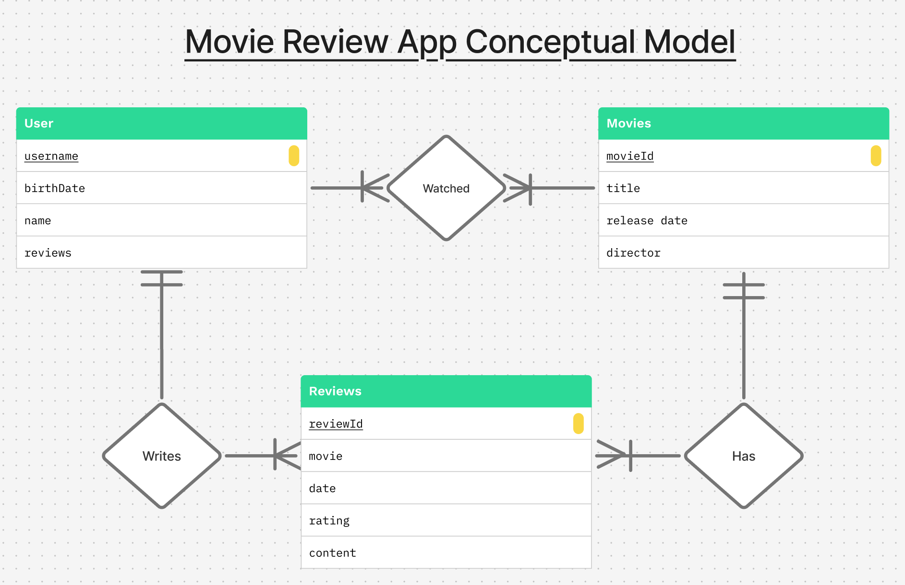
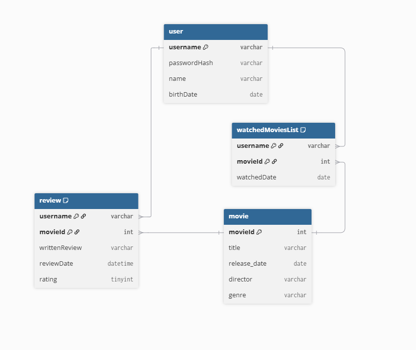
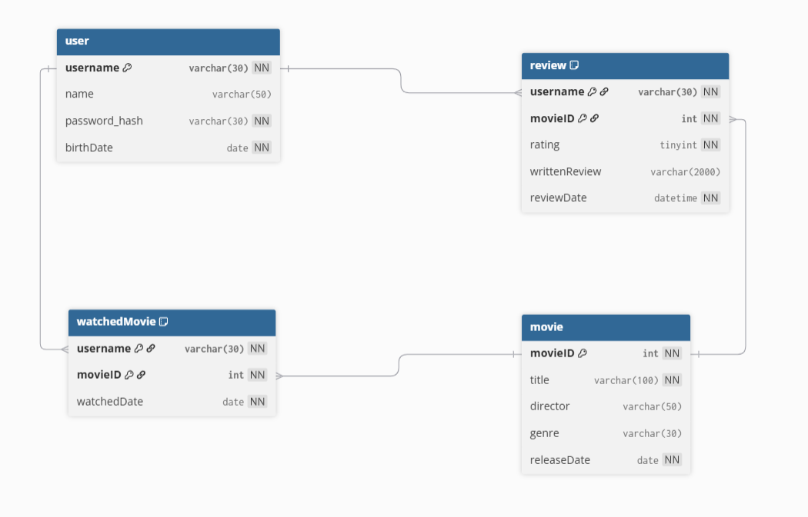

# Group - Database Design

## Models

### 1 - Conceptual Model

```markdown
# Entities
Our conceptual model has 3 entities:
- Users: The consumer of the app. This entity holds information about the User's `username`, `birth date`, `name`, and `reviews`.
- Movies: The main entity that Users interact with either by watching or reviewing. This entity holds information such as
`movie ID`, `title`, `release date`, and `director`
- Reviews: This is the entity that holds the data about Reviews such as the `review ID`, `movie`, `date`, `rating`, and `content` of the
review. This entity connects Users and Movies.

# Relationships
There are three main interactions that are between Users and Movies, Users and Reviews, and Reviews and Movies.
- There is a many-to-many relationship between Users and the Movies they have watched. Many Users
can watch many Movies. Many Movies have also been watched by many Users.
- A User can write many reviews but Reviews are tied to only one User.
- For the relationship between Reviews and Movies, one Movie can have many Reviews but one Review
can only be tied to a single Movie.

# Main Actions
1. User can watch many Movies
2. User writes many Reviews, but each Review is tied to a unique Movie.
3. Reviews populate the Movie's review tab
```


- - -

### 2 - Logical Model

```markdown
# Entities
- Movie
  - Primary Key: `movieID`
  - Attributes: `title`, `director`, `genre`, `releaseDate`
  - Represents movies in the database.

- User
  - Primary Key: `username`
  - Attributes: `name`, `birthDate`
  - Represents registered users who can review and track movies.

- Review
  - Composite Primary Key: (`username`, `movieID`)
  - Foreign Keys: 
    - `username` → `user(username)`  
    - `movieID` → `movie(movieID)`
  - Attributes: `rating`, `writtenReview`, `reviewDate`
  - Connects user and movie tables through reviews.

- WatchedMovie
  - Composite Primary Key: (`username`, `movieID`)
  - Foreign Keys:  
    - `username` → `user(username)`  
    - `movieID` → `movie(movieID)`
  - Attribute: `watchedDate`
  - Tracks movies watched by specific users, including the date watched.

# Relationships
The logical model has four tables in total. The watchedMovie table was added to resolve the many to many relationship between user and movie tables.

- Composite key (`username`,  `movieID`) in watchedMovie ensures that each user can only have one instance of a specific movie labeled as watched.
- A user can write multiple reviews but only one review per movie based on the user and review table relation.

# Main User Actions
- Sign up / Sign in to their account
- Browse movie
- Leave reviews / ratings
- View / edit reviews
- Add movies to a watched list
```



### Changes to Final Project Logical Model

```markdown
# User Table Changes

- Attributes
  - No longer has `password_hash` attribute as we did not get to implement secure sign in
```

- - -

### 3 - Physical Model

```markdown
# Entities
- Movie
  - Primary Key: `movieID`
  - Attributes: `title`, `director`, `genre`, `releaseDate`
  - Represents individual films in the database.

- User
  - Primary Key: `username`
  - Attributes: `name`,`birthDate`
  - Represents registered users who can review and track movies.

- Review
  - Composite Primary Key: (`username`, `movieID`)
  - Foreign Keys: 
    - `username` → `user(username)`  
    - `movieID` → `movie(movieID)`
  - Attributes: `rating`, `writtenReview`, `reviewDate`
  - Connects users and movies through ratings and written feedback.

- WatchedMovie
  - Composite Primary Key: (`username`, `movieID`)
  - Foreign Keys:  
    - `username` → `user(username)`  
    - `movieID` → `movie(movieID)`
  - Attribute: `watchedDate`
  - Tracks which movies each user has watched and when.

# Relationships
- A User can write multiple Reviews, but only one per Movie (1:Many from User → Review, Many:1 from Review → Movie).  
- A User can watch multiple Movies, each stored in WatchedMovie (Many:many so made WatchedMovie table).  
- Movie and User are connected through both Review and WatchedMovie tables.

# Main User Actions
- Register and log in as a user.  
- Browse or search for movies.  
- Record movies they’ve watched.  
- Write, edit, or view reviews and ratings for movies. 
```



### Changes to Final Project Physical Model

```markdown
# User Table Changes

- Attributes
  - No longer has `password_hash` attribute as we did not get to implement secure sign in
```

[Physical Model Source Code](./Models/PhysicalModelSourceCode.dbml)
- - -

## Table Initialization

```Initialization Scripts includes all tables, foreign keys, and sample data needed for the database```

[Initialization Scripts](./InitializationScripts/init_collectiviews.sql)

[Docker Compose File](./docker-compose.yml)

### How to use a Docker compose file to create a database in MariaDB
1. Create or recieve a docker-compose.yml file to act as a blueprint for the Docker container you wish to set up
2. Place the docker-compose.yml file in a directory with an SQL init file
3. Navigate to the directory in your computer's terminal
4. Run the command `docker compose up` to build the container
5. In DBeaver, navigate to the top left of the screen and click the "New Database Connection" button to open the new connection menu
6. Select the database driver you wish to use (this should be specified in the docker-compose.yml file) and click next
7. Under the "Server" menu, ensure that the port listed matches the one mapped in the docker compose file
8. Under the "Authentication" menu, enter the username and password displayed in the docker compose file
   1. For Example of user and password:
      1. `MYSQL_USER=user`
      2. `MYSQL_PASSWORD=password`
9.  Click "Finish" and DBeaver will connect to the container and you should be able to interact with the database


## Business Related SQL Queries

```SQL Queries correspond to logical business needs and contain short return descriptions before each query```

Queries that were implemented and future queries yet to be implemented can be viewed here: [SQL Queries](./BusinessSqlQueries/Business_Queries.md)
