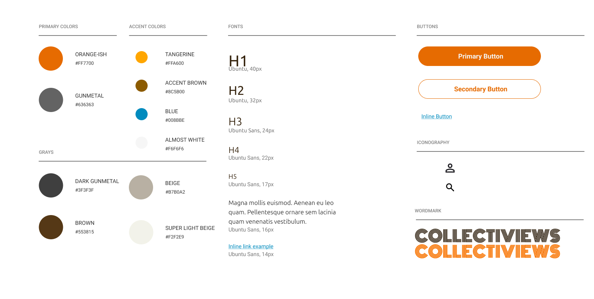

# Group - UI UX
## Wireframes
- 1 - Wireframe Name

```Description```


[Figma Wireframe 1 Name](https://)
- 2
- 3
- 4
- 5
- 6
- 7
- 8
## Brand Guide

[Figma Brand Guide Link](https://www.figma.com/design/avwZFveh8jLwZiGxuPMK3e/Fantastic-4?node-id=48-260&t=wRfWX2jjeckPt4dR-1)

- Personality Notes

```The brand guide is meant to create a light simplistic style for the website to follow. Complexity is really only seen in the wordmark. White or beige will be used as a main background, with the primary colors for main interaction points, accent colors for specific points (Yellow for stars in rating scale | Blue for hyperlinks). The vibe should of the website with the guide should be simplistic and avoid pushing too much information at once. ```
