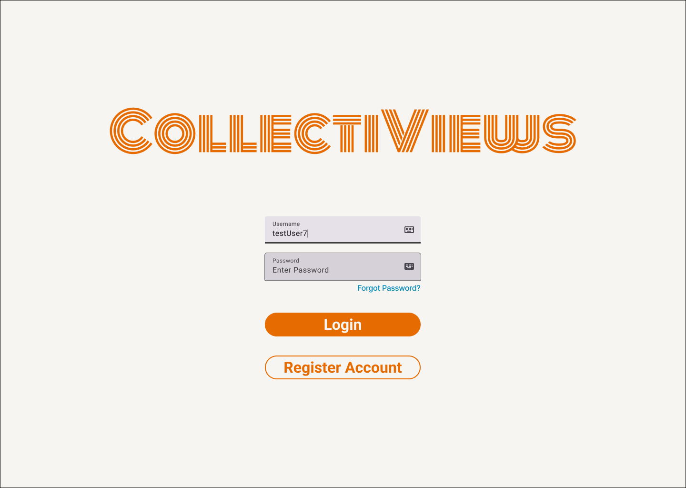
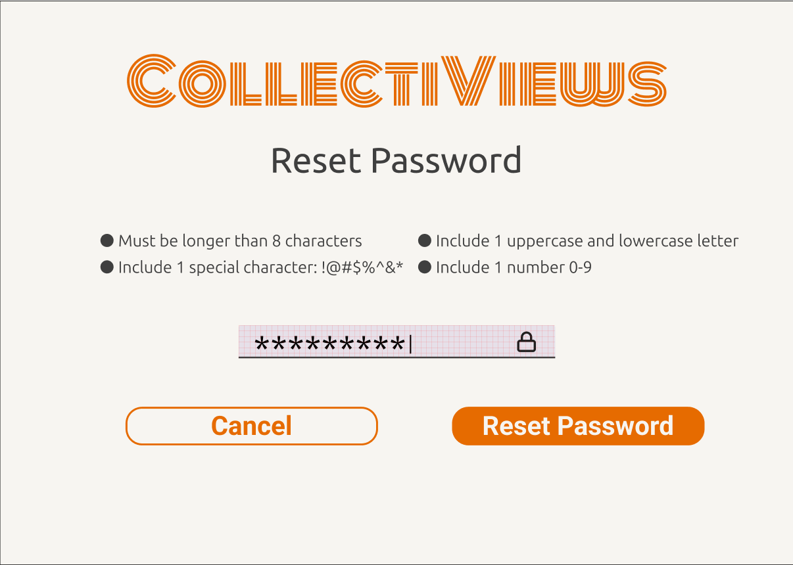
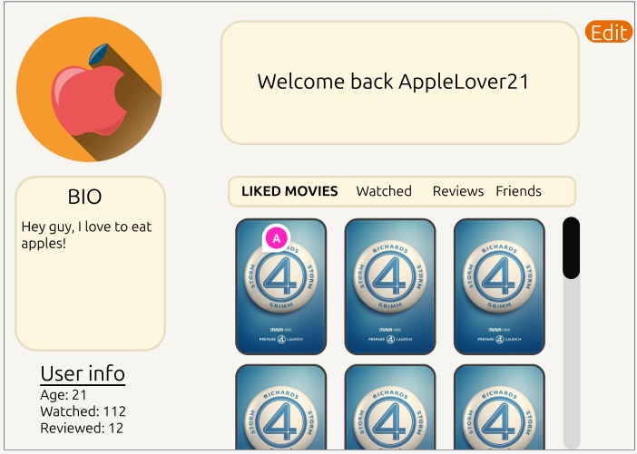
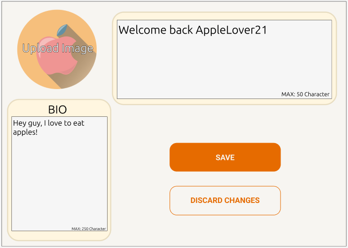
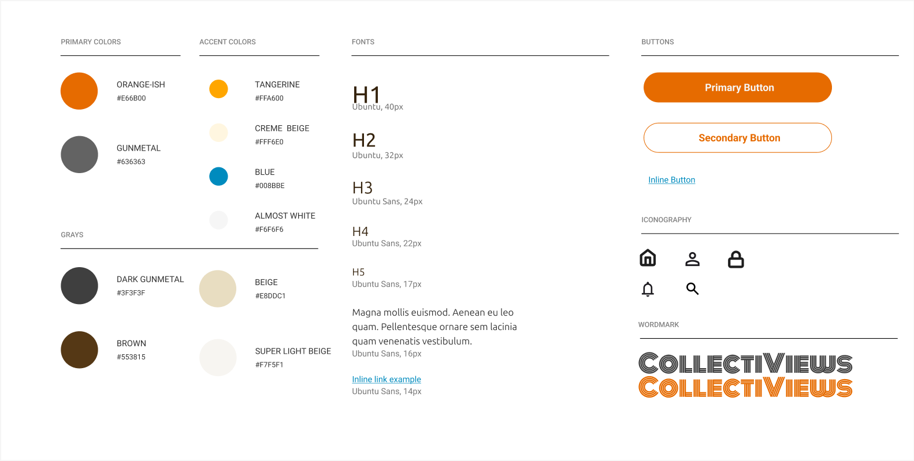

# Group - UI UX
## Wireframes
- 1 - Login

```This wireframe is for the generic user login page, it gives the option to navigate to the reset password page if necessary, and the ability to register a new account.```



[Figma Login Wireframe](https://www.figma.com/design/avwZFveh8jLwZiGxuPMK3e/Fantastic-4?node-id=2-4&t=5b4ifbydU8Wfh5Ru-1)
- 2 - Reset Password

```This wireframe is for password resets and includes requirements for a new password, and an option to return to the previous menu```



[Figma Reset Password](https://www.figma.com/design/avwZFveh8jLwZiGxuPMK3e/Fantastic-4?node-id=2-4&t=5b4ifbydU8Wfh5Ru-1)

- 3 - Edit Profile Page

```This wireframe provides a visual for how the profile page will look like. The contents of the page will include a profile picture, user bio, user information, and an edit button at the top right of the screen which will then lead to edit mode. This wireframe is the first step in editing the user's profile page.```



[Figma Profile Page](https://www.figma.com/design/avwZFveh8jLwZiGxuPMK3e/Fantastic-4?node-id=2-3&p=f&t=jPXlBce4bH4ecFxK-0)

- 4 - Edit Profile Page (Edit Mode)

```This wireframe shows how the user will edit their profile page. Afterward, the user will either click save or discard changes which successfuly follows the outlined user flow.



[Figma Profile Page Edit Mode](https://www.figma.com/design/avwZFveh8jLwZiGxuPMK3e/Fantastic-4?node-id=2-3&p=f&t=jPXlBce4bH4ecFxK-0)
  
- 5
- 6
- 7
- 8
## Brand Guide

[Figma Brand Guide Link](https://www.figma.com/design/avwZFveh8jLwZiGxuPMK3e/Fantastic-4?node-id=48-260&t=wRfWX2jjeckPt4dR-1)

- Personality Notes

```The brand guide is meant to create a light simplistic style for the website to follow. Complexity is really only seen in the wordmark. White or beige will be used as a main background, with the primary colors for main interaction points, accent colors for specific points (Yellow for stars in rating scale | Blue for hyperlinks). The vibe should of the website with the guide should be simplistic and avoid pushing too much information at once. ```
